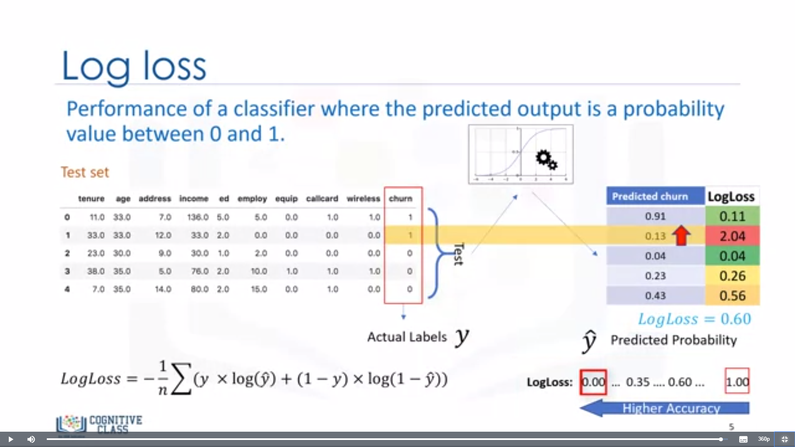
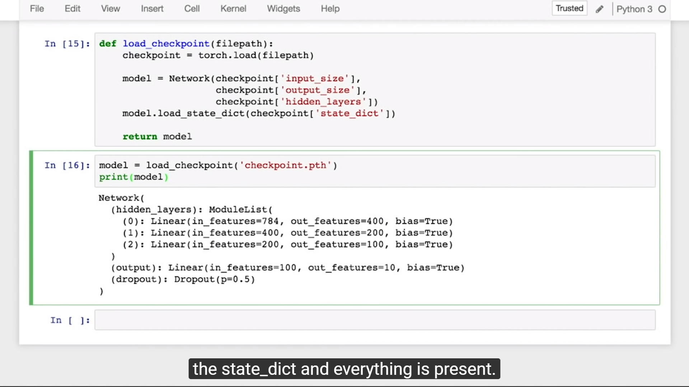

# 100daysofML
I am using a open source platform to showcase my work and motivate others to work along with me.

## Day1: 27th Nov
[Mobile Price Classification](https://www.kaggle.com/iabhishekofficial/mobile-price-classification)

## Day2: 28th Nov
XGBoost [Link1](https://www.analyticsvidhya.com/blog/2018/09/an-end-to-end-guide-to-understand-the-math-behind-xgboost/) [Link2](https://machinelearningmastery.com/gentle-introduction-xgboost-applied-machine-learning/) [How to use XGBoost with Python](https://machinelearningmastery.com/develop-first-xgboost-model-python-scikit-learn/)

 ## Day3: 30th Nov
 Pytorch Udacity Introduction Lesson 2
(Videos 1 to 25 complete)

## Day4: 1st Dec
Study about [Accuracy Paradox](https://towardsdatascience.com/accuracy-paradox-897a69e2dd9b)

## Day5: 2nd Dec
Classification Algorithms study: [KNN](https://www.geeksforgeeks.org/k-nearest-neighbours/), [SVC](https://www.analyticsvidhya.com/blog/2017/09/understaing-support-vector-machine-example-code/), [K-medoid](https://www.youtube.com/watch?v=cA0FBZE-948)

## Day6: 4th Dec
Studied About Apriori Algorithm Association rule, How is it different from collaborative filtering?
Studied about example of market basket analysis.

[Apriori Introduction](https://www.hackerearth.com/blog/machine-learning/beginners-tutorial-apriori-algorithm-data-mining-r-implementation/) [Apriori vs Collaborative filtering](https://stats.stackexchange.com/questions/256012/item-item-collaborative-filtering-vs-market-basket-analysis)

## Day7: 5th Dec
Studied about [Spectral Clustering](https://towardsdatascience.com/spectral-clustering-for-beginners-d08b7d25b4d8)

## Day8: 6th Dec
Studying Natural Language Processing: CFG, CNF, CYK
CYK tells whether a given sentence can be generated from a given Content free grammer given.

Chomsky Normal Form is conversion from CFG to CNF. In CNF we have productions of form.
A-> BC
or A->epsilon

## Day9: 10th Dec
Cluster Algorithm KMeans, Heirarchical Clustering

## Day10: 11th Dec
Google Crash Course ML
+ [Introduction](https://developers.google.com/machine-learning/crash-course/ml-intro)
+ [Rules of Machine Learning](https://developers.google.com/machine-learning/guides/rules-of-ml/#rule_1_dont_be_afraid_to_launch_a_product_without_machine_learning)
+ [Framing](https://developers.google.com/machine-learning/crash-course/framing/video-lecture)

## Day11: 12th Dec
Worked on Neural Style transfer Project and Watched PyTorch Udacity (Lecture 2)
Working on Ben10 dataset

## Day12: 13th Dec
PyTorch Udacity Lecture 2 continue

## Day13: 15th Dec
Pytorch Udacity Lecture 2 continue

## Day14: 16th Dec
[Evaluation metric for Classification](https://www.coursera.org/lecture/machine-learning-with-python/evaluation-metrics-in-classification-5iCQt)
+ Jaccard Index:  JI = |Intersection| / |Union|
  * JI close to 1 means more similarity
  * JI close to 0 means less similarity
+ F1-Score = 2* Precision * Recall/ (Precision + Recall)
  * 1 is Best and 0 is Worst
+ Log Loss: Output of Class Label is Probability instead of categorical.
  * Log Loss measures the Performance of a classifier where the predicted output is a probability value between 0 or 1.
  * Log Loss calculated by Log loss equation.
  * Log Loss = (y * log(y predicted)) + (1-y) * (log(1 - (y predicted)))
  * Average Log Loss = -1/n * summation((y * log(y predicted)) + (1-y) * (log(1 - (y predicted))))
  * Lower Log Loss means Best Model and Higher Log Loss value means Poor Model.

  

## Day15: 17th Dec
Working on Car Dataset Question.
+ Shuffle rows of Dataset
  + `np.random.shuffle(DataFrame.values)`
+ Concat two dataframes
  + df1
  + df2
  + frames = [df1,df2]
  + result = pd.concat(frames,axis=1)
+ Rename Columns in Pandas
  + `df.rename(columns={'A':'a'},inplace=True)`

## Day16: 20th Dec
+ Worked on ZigWheels dataset
+ How qcut works?
  + `pd.qcut(dataset, precision=3, labels=['low','med','high'])`
+ [mean_squared_log_error](https://scikit-learn.org/stable/modules/generated/sklearn.metrics.mean_squared_log_error.html)
+ [average_precision_score](https://scikit-learn.org/stable/modules/generated/sklearn.metrics.average_precision_score.html#sklearn.metrics.average_precision_score) works on y_true binary and y_scores continous

## Day17: 23rd Dec
Udacity PyTorch Lecture 2, neural network finished.

## Day18: 24th Dec
Udacity Talk on PyTorch
Lecture 3 finished.

#### Started Lecture 4, Pytorch
+ Single Layer Neural network
  * features = torc.rand((1,5)) # createda (1,5) shape tensor
  * Method 1 :y = activation(torch.sum(features*weights)+bias)
  * Method 2: weights = weights.view(5,1) # used to reshape a tensor vector
    + y = activation(torch.mm(features,weights)+bias)
## Day19: 27th Dec
Lecture 4 Started

## Day20: 29th Dec
Lecture 4 Continue

## Day21: 1st Jan
Lecture 4 Almost finished
Learned how to Save Weights of a Trained Model.

## Day22: 2nd Jan
Finished Lecture 4 and Started lecture 5
CNN chapter start watched videos till Video 14.

## Day23/24/25: 4th Jan - 6th Jan
PyTorch Project on Google Colab Started.
+ [Google Colab File FlowerClassification](https://colab.research.google.com/drive/11Q0KV4g8R_ZhNveLoBtO8BxUjwuRm2kR)
+ [Model Link](https://drive.google.com/file/d/1mCt6QsGzazJUiSEZ8aNW3eYwQQ9VWM2j/view?usp=sharing)

## Day26: 10th Jan
R programming Decision Tree, PCA, NaiveBayes, Linear Regression

## Day27: 20th Jan
Artcile on Feature Selection
+ [Link](https://towardsdatascience.com/why-how-and-when-to-apply-feature-selection-e9c69adfabf2)

+ [Correlation Method](https://towardsdatascience.com/why-feature-correlation-matters-a-lot-847e8ba439c4)

+ [Techniques](https://towardsdatascience.com/feature-selection-techniques-in-machine-learning-with-python-f24e7da3f36e)

[Difference B/W Covariance and Correlation](https://keydifferences.com/difference-between-covariance-and-correlation.html)

### Feature Selection [ VERY IMPORTANT TOPIC ]:
Why is feature selection Important?
+   Training time increases exponentially with number if features.
+   Models have increasing risk of overfitting with increasing number of features.

Feature selection Techniques
1. Filter methods
2. Wrapper methods
3. Embedded methods

#### Filter methods
Filter method considers the relationship b/w features and the target variable to compute the importance of features.

#### Wrapper methods
Wrapper Methods generate models with a subsets of feature and gauge their model performances.

#### Embedded Methods
Feature selection by insights provided by some Machine Learning Model.

## Day28: 24th Jan
### Loss Functions:- [Loss Functions](https://ml-cheatsheet.readthedocs.io/en/latest/loss_functions.html)

### How to determine the value of K in clustering problems?
+   [3 Methods: Elbow Method, Average Silhouette method, Gap statistic method](https://www.datanovia.com/en/lessons/determining-the-optimal-number-of-clusters-3-must-know-methods/)
+   [Resource Link2](http://www2.stat.duke.edu/~rcs46/lectures_2017/10-unsupervise/10-specify-clusters.pdf)
+   [Gap statistic](https://datasciencelab.wordpress.com/tag/gap-statistic/)

### What causes overfitting, How to prevent it?
+   Overfitting causes: Too many features, High epochs training with validation loss, many hidden layers, Good Performance in training set and poor generalization in test set.
+   [What is it?](https://www.geeksforgeeks.org/underfitting-and-overfitting-in-machine-learning/)
+   [Conceptual Explaination](https://towardsdatascience.com/overfitting-vs-underfitting-a-conceptual-explanation-d94ee20ca7f9)
+   [Deep learning and overfitting](https://towardsdatascience.com/deep-learning-3-more-on-cnns-handling-overfitting-2bd5d99abe5d)

### What is SVD(Singular value decomposition)?
+   Mainly used for matrix decomposition
+   Mostly used in Recommendation systems.
+   [SVD link1](https://medium.com/the-andela-way/foundations-of-machine-learning-singular-value-decomposition-svd-162ac796c27d)
+   [SVD link2](https://medium.com/data-science-group-iitr/singular-value-decomposition-elucidated-e97005fb82fa)
+   [SVD MIT tutorial](http://web.mit.edu/be.400/www/SVD/Singular_Value_Decomposition.htm)
+   [BEST explaination SVD](https://blog.statsbot.co/singular-value-decomposition-tutorial-52c695315254)
+   [Working and calculation Video](https://www.youtube.com/watch?v=mBcLRGuAFUk)

## Day30: 17th Sept 2020
+ Learning about Ranking Problems with MCDA or MCDM.
+ Understanding how MCDM works with Research Paper [LINK](https://sci-hub.tw/https://link.springer.com/chapter/10.1007/978-1-4757-3157-6_2)
+ Studied WSM, WPM, AHP, ELECTRE, TOPSIS and MOORA
+ Basics of MCDA [Youtube Video](https://www.youtube.com/watch?v=7OoKJHvsUbo&ab_channel=HealthOutcomesStrats)

## Day31: 18th Sept 2020
+ Study Comparative Analysis of MCDA techniques [LINK1](http://www.theijes.com/papers/v2-i6/Part.4/D0364027034.pdf) | [LINK2](http://www.orstw.org.tw/ijor/vol10no2/ijor_vol10_no2_p56_p66.pdf)

## Study Data Science Interview From Scratch:
1. Linear Regression: https://medium.com/datadreamsdragons/algorithms-the-pillars-of-data-science-72543d0e1473
2. Optimisation Algorithms: https://machinelearningmastery.com/tour-of-optimization-algorithms/
3. Optimisation other than gradient descent: https://stats.stackexchange.com/questions/97014/what-are-alternatives-of-gradient-descent
4. Logistic Regression: https://medium.com/datadreamsdragons/part-iii-logistic-regression-4a024c896ed
5. Encoders in Data science: https://www.analyticsvidhya.com/blog/2020/08/types-of-categorical-data-encoding/
6. Multi-Class Classification Softmax: https://towardsdatascience.com/multiclass-classification-with-softmax-regression-explained-ea320518ea5d
7. Maximum LikeliHood: https://www.youtube.com/watch?v=XepXtl9YKwc&vl=en&ab_channel=StatQuestwithJoshStarmer
8. Maximum Likelihood for Normal Distribution: https://www.youtube.com/watch?v=Dn6b9fCIUpM&ab_channel=StatQuestwithJoshStarmer
9. Naive Bayes Classifier: https://www.youtube.com/watch?v=jS1CKhALUBQ&ab_channel=KrishNaik
10. AUC-ROC Curve: https://towardsdatascience.com/understanding-auc-roc-curve-68b2303cc9c5
11. AUC-ROC video: https://www.youtube.com/watch?v=4jRBRDbJemM&ab_channel=StatQuestwithJoshStarmer
12. MultiLabel Classification: https://towardsdatascience.com/journey-to-the-center-of-multi-label-classification-384c40229bff
13. One-vs-All or One-vs-One: https://machinelearningmastery.com/one-vs-rest-and-one-vs-one-for-multi-class-classification/
14. Adaptive Method (ML-kNN) || Multi Label Classification: https://cs.nju.edu.cn/zhouzh/zhouzh.files/publication/pr07.pdf
15. Ensemble Method for MultiLabel Classification - Random K-Label (RAKEL) Algorithm: https://www.youtube.com/watch?v=_7v_1UvaPr4&ab_channel=RANJIRAJ
16. k-Fold Cross Validation: https://www.youtube.com/watch?v=fSytzGwwBVw&ab_channel=StatQuestwithJoshStarmer
17. Handle Unfitting: https://medium.datadriveninvestor.com/how-to-handle-overfitting-and-underfitting-470a1f7389fe
18. Ridge Regression (L2 Regularisation): https://www.youtube.com/watch?v=Q81RR3yKn30&ab_channel=StatQuestwithJoshStarmer
19. Lasso Regression (L2 Regularisation): https://www.youtube.com/watch?v=NGf0voTMlcs&ab_channel=StatQuestwithJoshStarmer
20. Decision Tree: https://medium.com/datadreamsdragons/part-iv-decision-trees-4992e2038a00
21. Regressor Trees & Avoid Ovefit with Min. Split Concept[Important]: https://www.youtube.com/watch?v=g9c66TUylZ4&ab_channel=StatQuestwithJoshStarmer
22. Regressor Tree, How to Prune?: https://www.youtube.com/watch?v=D0efHEJsfHo&ab_channel=StatQuestwithJoshStarmer
23. Bagging (Random Forest I): https://www.youtube.com/watch?v=J4Wdy0Wc_xQ&list=PLblh5JKOoLUIE96dI3U7oxHaCAbZgfhHk&ab_channel=StatQuestwithJoshStarmer
24. Bagging (Random Forest II):  
25. Covariance vs Correlation: 
26. Hypothesis Testing:
27. Chi-Square Test:
28. Boosting:
29. Stacking:
30. RAKEL Algorithm | Multi-Label Classification: 
31. 
32. LDA:
33. PCA:
34. SVM:
35. Collaborative Filtering:
36. Word2vec:
37. TFIDF:
38. BERT:
39. Negative Sampling: 
40. Weight of Evidence and IV: 
